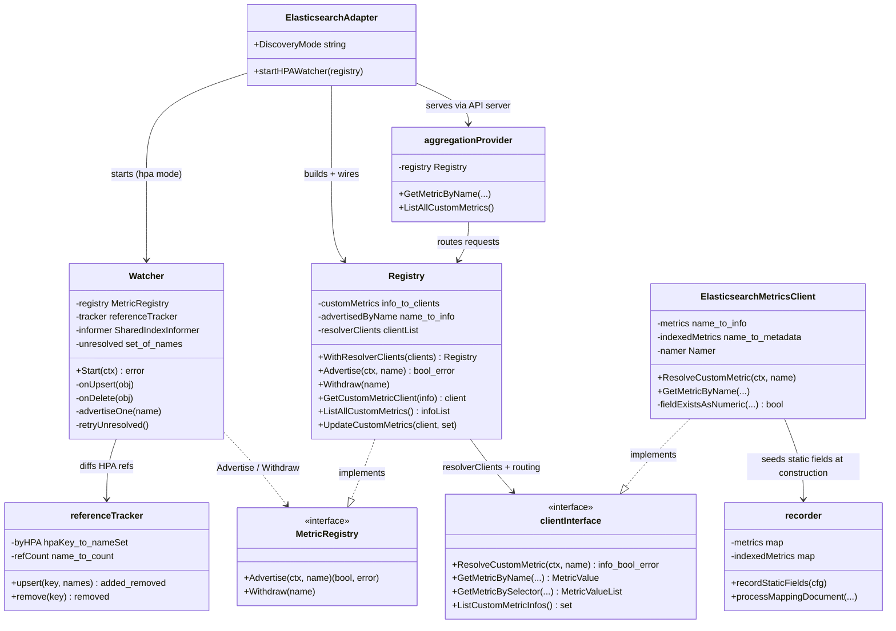
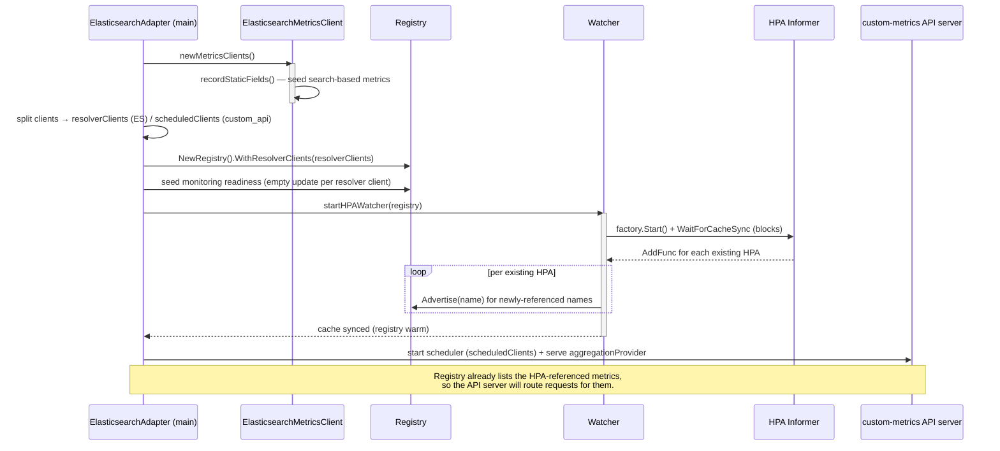
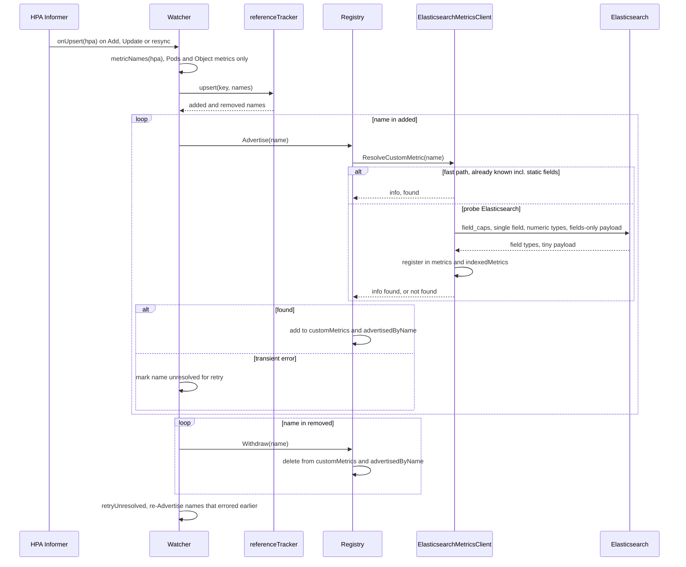
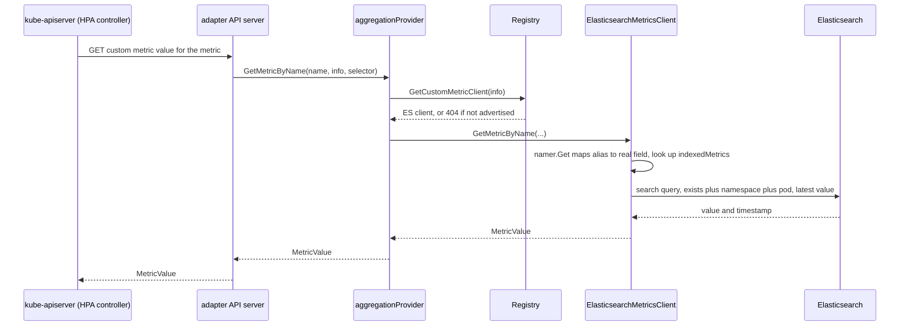
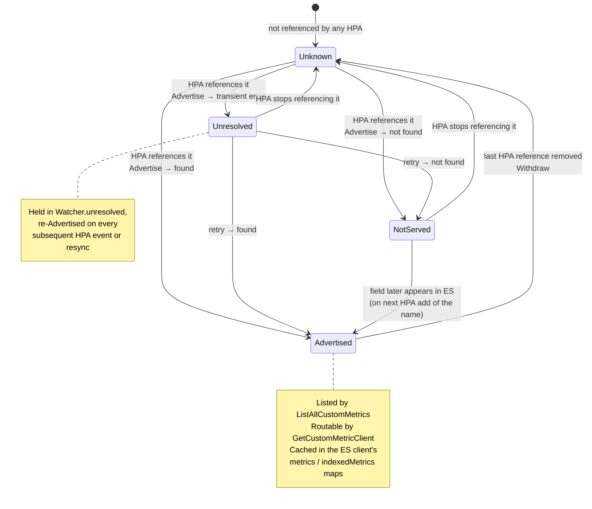

# HPA-driven discovery mode

This document explains how the adapter serves custom metrics when started with
`--discovery-mode=hpa`, and how the main components collaborate.

## Why this mode exists

The adapter implements the Kubernetes [custom metrics API](https://github.com/kubernetes/metrics)
so an HPA can scale a workload on a metric stored in Elasticsearch.

The original (`periodic`) mode discovered metrics by fetching the **entire**
`_mapping` of each configured index pattern every minute and decoding it into
`map[string]interface{}`. For large indices this can require a lot of memory,
repeated every minute. The scan is also wasteful: it advertises every numeric
field so that a handful of consumers can read a few.

`hpa` mode inverts the model. Instead of discovering *everything* and hoping
someone uses it, it observes **which metrics are actually referenced by HPAs**
and resolves only those, each with a targeted `_field_caps` call (server-side
filtered to numeric types, with the bulky `indices` section stripped from the
response). Memory pressure drops from "the whole mapping every minute" to "one
tiny lookup per distinct metric, once".

A subtlety drives the whole design: the Kubernetes API server **404s a request
for a metric the adapter has not advertised**, before the request ever reaches
us. So lazily resolving on first request is not enough — the metric must be
*advertised* (present in `ListAllCustomMetrics`) ahead of time. Watching HPAs is
how we know what to advertise.

## Components at a glance

| Component | Package | Responsibility |
|---|---|---|
| `ElasticsearchAdapter` | `main` | Process entry point. Parses flags, builds clients, wires everything, starts the HPA watcher + scheduler + API server. |
| `Watcher` | `pkg/hpa` | Watches `HorizontalPodAutoscaler` objects via an informer; turns HPA changes into `Advertise`/`Withdraw` calls. |
| `referenceTracker` | `pkg/hpa` | Ref-counts which metric names are referenced by which HPAs; reports the first add and last removal of each name. |
| `Registry` | `pkg/registry` | Central routing + advertisement table. Resolves a name to a client (`Advertise`), lists advertised metrics, routes value requests (`GetCustomMetricClient`). |
| `elasticsearch.MetricsClient` | `pkg/client/elasticsearch` | Talks to ES. Resolves a metric via `_field_caps` (`ResolveCustomMetric`) and fetches values (`GetMetricByName`/`BySelector`). |
| `recorder` | `pkg/client/elasticsearch` | Builder that accumulates `{metrics, indexedMetrics}` while discovering. Seeds static (search-based) fields at client construction. |
| `custom_api.metricsClient` | `pkg/client/custom_api` | Non-ES backend. Still uses periodic discovery; its list endpoint is cheap. |
| `aggregationProvider` | `pkg/provider` | Implements the custom-metrics-apiserver provider interface; the bridge from the K8s API to the `Registry`. |
| monitoring server | `pkg/monitoring` | `/readyz` + Prometheus metrics. |
| scheduler | `pkg/scheduler` | Periodic discovery loop, used only for non-ES clients in this mode. |

> **Resolution.** There is no separate "resolver" object: the `Registry` holds
> the list of *resolver clients* and its `Advertise` method resolves a metric by
> walking them. When this doc says "the registry resolves a metric", that is what
> it means.

## Structure (class diagram)

Key relationships:

- The `Watcher` depends only on the small `MetricRegistry` interface
  (`Advertise`/`Withdraw`), not the concrete `Registry` — easy to test with a fake.
- The `Registry` depends on `client.Interface`, so it treats Elasticsearch and
  custom-api backends uniformly.
- `customMetrics` is simultaneously the **advertisement catalogue** (what
  `ListAllCustomMetrics` returns) and the **routing table** (what
  `GetCustomMetricClient` looks up). `advertisedByName` is a secondary index so a
  metric can be withdrawn by its plain name.

## Startup (sequence diagram)

The watcher's `Start` **blocks on cache sync** on purpose: by the time the API
server begins serving, every metric referenced by an already-existing HPA is
advertised, so the very first scrape is not a 404.

## HPA event flow (sequence diagram)

What happens when an HPA is created, updated, or deleted:

Notes:

- `metricNames` only extracts **Pods** and **Object** metric types — those are
  the ones served via the custom metrics API. `Resource`/`ContainerResource`
  (cpu/memory) and `External` metrics go through other APIs and are ignored.
- The `referenceTracker` ensures a name is advertised when the **first** HPA
  references it and withdrawn when the **last** one stops — `Advertise` is never
  called redundantly for an already-tracked name, which is why the registry
  needs no per-name resolution cache.
- `retryUnresolved` exists because the tracker reports each name as `added` only
  once. If that single `Advertise` hit a transient ES error, the name would
  otherwise never be retried. Names that errored are kept in an `unresolved` set
  and re-attempted on every later HPA event (status updates and the informer's
  10-minute resync both re-deliver objects). It is a no-op in steady state.

## Serving a metric value (sequence diagram)

Once a metric is advertised, this is what a scaling query looks like:

The value path uses the `indexedMetrics` metadata (index pattern + field, or a
search body for static fields) that was populated during `ResolveCustomMetric` /
`recordStaticFields`. Listing (`ListAllCustomMetrics`) takes the same provider →
registry hop but just enumerates `customMetrics`.

## Lifecycle of a single metric (state diagram)

- **Advertised** is the only state visible to Kubernetes. The metric is in
  `customMetrics` (so it is listed and routable) and `advertisedByName` (so it
  can be withdrawn by name).
- **NotServed** means the registry returned `found=false`. The watcher does not
  retry it (no `unresolved` entry); it is reconsidered only when the name is
  added again as a *fresh* reference (its ref-count goes 0 → 1 again), which
  re-probes Elasticsearch. There is no negative cache, so the cost of a
  not-served name is exactly one `_field_caps` call per fresh reference.
- **Withdraw** removes the metric from the registry but **not** from the ES
  client's internal maps. That is deliberate: if an HPA references it again,
  `ResolveCustomMetric`'s fast path returns the cached metadata with no ES call.
  The set of distinct HPA-referenced metrics is small, so this cache is bounded.

## `periodic` vs `hpa` at a glance

| | `periodic` | `hpa` |
|---|---|---|
| ES discovery | full `_mapping` scan every minute | per-metric `_field_caps`, on demand |
| What's advertised | every numeric field in the index | only metrics referenced by an HPA |
| Trigger | scheduler tick | HPA add/update/delete events |
| Registry populated by | `UpdateCustomMetrics` (scheduler) | `Advertise`/`Withdraw` (watcher) |
| Static (search) fields | recorded each discovery cycle | seeded once at client construction |
| Memory profile | high, grows with index size | low, bounded by HPA count |
| RBAC | — | `get`/`list`/`watch` on `horizontalpodautoscalers` |

In `hpa` mode, **only Elasticsearch clients** take the resolver path; other
client types (e.g. custom-api) keep going through the periodic scheduler because
their list endpoints are cheap.
